# Dutch Energy Price Analysis and Forecasting

This project implements a machine learning pipeline for analyzing and forecasting Dutch energy prices using data from the ENTSO-E API and generation data from the Nederlandse Energie Dashboard (NED). The project is structured in two distinct phases:

## Phase 1: Model Optimization and Point Forecasting
- **Training Period**: January 2023 - January 2024
- **Test Period**: January 2024 - March 2024
- **Focus**: Optimizing models for point forecasts across multiple horizons (t+14h to t+38h)
- **Models**: XGBoost, Autoregressive, and Linear implementations

## Phase 2: Uncertainty Estimation
- **Training Period**: January 2023 - March 2024
- **Test Period**: March 2024 - June 2024
- **Focus**: Constructing and evaluating prediction intervals
- **Methods**:
  - Location-Scale-Shape (LSS) XGBoost (probabilistic forecasting, parametric)
  - Quantile Regression (pinball loss function applied to XGBoost)
  - Ensemble-based Nonparametric Bootstrap Intervals (ENBI) (nonparametric, bootstrap-based, distribution-free, but requires a large number of bootstrap samples, and assumes interchangeability of errors (through Leave one out cross-validation))
  - Split Conformal Prediction Intervals (SPCI) (distribution-free, requires 2 models, one for estimating the mean or median (XGBoost) and one for quantile regression, where the quantile regression model is trained on the residuals of the mean or median model of the last 100 samples up until the current time)
  - Sieves Bootstrap (nonparametric in the sense that it does not assume a distribution of the errors, but it assumes autocorrelation of the errors, therefor the residuals of the XGBoost model are bootstrapped with autocorrelation taken into account, by applying a AR model to the residuals)


Overall quite the party!

## Project Structure

```
thesis-dutch-energy-analysis/
├── data/
│   ├── analysis_output/   # Analysis results and metrics
│   ├── analysis_scripts/   # Analysis scripts
│   ├── data_processing/   # Data processing scripts
│   │   ├── convert_units.py
│   │   ├── outlier_removal.py
│   │   ├──prepare_features.py
│   │   ├──prepare_multivariate_features.py
│   │   ├──prepare_multivariate_nooutliers.py
│   │   ├──Prepare_testdata.py
│   │   ├──Prepare_testset_features.py
│   │   ├── process_raw_data.py
│   │   └── testset_topfeatures.py
│   ├── processed/         # Processed datasets
│   └── raw/              # Raw data files
├── models_14_38/        # Models for 14-38h forecasting
│   ├── ar/              # Autoregressive models
│   │   ├── linear_setlags_rollingwindowstepsizeone.py
│   │   ├── rolling_ar_windowplaying.py
│   │   └── simple_arp_recursive.py
│   ├── Linear_with_lags/ # Linear models with lagged features
│   │   ├── linear_full_features.py
│   │   ├── RFECV_linear_with_lags.py
│   │   └── simple_linear_lags_and_dummies.py
│   ├── linear_no_lags/   # Baseline linear models
│   └── xgboost/          # XGBoost implementations
│       ├── XGBoost_test_features_hyperparameters_cv/
│           └── CV_XGBoostLSS.py
│           └── quantile_predictions_modelperq.py
│           ├── test_xgboostlss.py
│           ├── xgboost_clean_full_features.py
│           ├── xgboost_CV_multiple_window_sizes.py
│           └── xgboost_hyperopt.py
│           └── xgboost_quantile_subset_features.py
│           ├── xgboost_clean_price_features_only.py
│           └── XGBoost_topfeaturesselection.py
│           ├── xgboostLSS_clean_full_features.py # Location-Scale-Shape 
│      ├──      #Bootstrap methods and optimized LSS, optimized XGBoost              
│            ├── ENBPIonline.py 
│            ├── ENBPIXGboost.py             # ENBI Implementation
│            ├── Hyperopt_XGboostLSS.py                # Base Optimized Implementation
│            ├── OptimizedXGboost.py

                  # Sieves and Split Conformal Prediction Intervals
│       ├── SievesXGBoost.py                   # Sieves Bootstrap Implementation
│       ├── SPCIonline.py                   # Sieves Bootstrap Implementation
│       ├── SPCIbatcherror.py                   # SPCI Alternative Implementation
│       ├── XGBoost_pinball_fulltrain.py       # Pinball Loss Training
│       ├── XGBoost_clean_price_featuresonly/                    # Testing implementations


└── utils/              # Utility functions
```

## Setup and Installation

1. Create and activate a virtual environment:
```bash
python3 -m venv venv
source venv_py3/bin/activate
```

2. Install dependencies:
```bash
pip install -r requirements.txt
```

# Phase one: Model Optimization and Point Forecasting

## Data Processing Pipeline

## Required Data

The repository includes the raw prices data file:
- `data/raw/raw_prices_2023_2024.csv`


Due to file size limitations, the generation data file is not included in the repository. You will need to obtain the following file separately and place it in the `data/raw/` directory:
- `generation_by_source_2023_2024.csv`
[text](data/raw/generation_by_source.csv)

The other data (consumption, forecasts and prices can be obtained from the entsoe website with an API key.) But you can also get it from the Nederlandse Energie Dashboard, but please email arussiconsult@outlook.com l for the file if you need it. 

Other necessary data files will be generated through the processing pipeline.


To reproduce the analysis, follow these steps to process the data:

1. **Process Raw Data**
   ```bash
   python data/data_processing/process_raw_data.py
   ```
   This script will process the raw data files and create the initial merged dataset.

2. **Convert Units**
   ```bash
   python data/data_processing/convert_units.py
   ```
   This standardizes all measurements to consistent units.

3. **Prepare Features**
   ```bash
   python data/data_processing/prepare_features.py
   python data/data_processing/prepare_multivariate_features.py

   ```
   These scripts create the base feature set and additional features for model training. these do not prepare yet for phase 2 (uncertainty estimation, since a new testset is prepared for this seperately)


 ## Feature Engineering Pipeline

The feature engineering pipeline creates a rich set of features for the XGBoost model. Here's a detailed overview of the feature creation process:

```mermaid
graph TD
    A[Raw Price Data] --> B[Time Features]
    A --> C[Holiday Features]
    A --> D[Lag Features]
    A --> E[Price Differences]

    subgraph Time Features
        B --> B1[Basic Time Features]
        B --> B2[Cyclical Encoding]
        B --> B3[Part of Day]
        B1 --> B1_1[Hour of Day]
        B1 --> B1_2[Day of Week]
        B1 --> B1_3[Month]
        B1 --> B1_4[Quarter]
        B2 --> B2_1[Hour Sin/Cos]
        B2 --> B2_2[Month Sin/Cos]
        B2 --> B2_3[Day Sin/Cos]
        B3 --> B3_1[Morning 6-12h]
        B3 --> B3_2[Afternoon 12-18h]
        B3 --> B3_3[Evening 18-22h]
        B3 --> B3_4[Night 22-6h]
    end

    subgraph Holiday Features
        C --> C1[Dutch Holidays]
        C --> C2[Weekend Indicator]
        C1 --> C1_1[Is Holiday]
        C1 --> C1_2[Day Before Holiday]
        C1 --> C1_3[Day After Holiday]
    end

    subgraph Lag Features
        D --> D1[Price Lags]
        D --> D2[Rolling Statistics]
        D1 --> D1_1[1h, 2h, 3h Lags]
        D1 --> D1_2[24h, 48h, 72h Lags]
        D1 --> D1_3[Week Lag 168h]
        D2 --> D2_1[Rolling Mean]
        D2 --> D2_2[Rolling Std]
    end

    subgraph Price Differences
        E --> E1[Hour-to-Hour]
        E --> E2[Day-to-Day]
        E --> E3[Week-to-Week]
    end

    B --> F[Feature Scaling]
    C --> F
    D --> F
    E --> F
    F --> G[Final Feature Set]
```



### Feature Categories

1. **Base Features** (7 total):
   - Price (EUR/MWh)
   - Wind generation (MW)
   - Solar generation (MW)
   - Consumption (MW)
   - Historical and forecast values

2. **Time Features** (18 total):
   - Hour, day, month
   - Cyclical encodings
   - Part of day indicators

3. **Holiday Features** (3 total):
   - Dutch public holiday indicators
   - Days before/after holidays
   - Weekend indicators

4. **Lagged Features** (64 total):
   - Short-term: 1h to 3h
   - Daily: 24h, 48h, 72h
   - Weekly: up to 168h
   - Applied to all variables

5. **Rolling Statistics** (82 total):
   - Mean, standard deviation
   - Min, max
   - Volatility measures

6. **Target Features** (25 total):
   - Horizons from t+14 to t+38

### Analyze data and features
   ```bash
   python data/analysis_scripts/analyze_data.py
   ```

### Model Training
   The processed features will be ready for use with any of the models in the `models_14_38` directory:
   
   **XGBoost Models** (`models_14_38/xgboost/`):
   1. Core Model (model is optimized for hyperparameters and features):
      - Optimized Implementation: `OptimizedXGboost.py``
   
   2. train models for hyperparameter optimization and cross validation, and feature selection:
      - `xgboost_hyperopt.py`
      - `XGboost_topfeaturesselection.py`
      - `xgboost_CV_multiple_window_sizes.py`
      - `xgboost_clean_full_features.py`
      - `xgboost_clean_price_features_only.py`
      

   **Autoregressive Models** (`models_14_38/ar/`):
   - Rolling Window Implementation: `rolling_ar_windowplaying.py`
   - Simple Recursive Prediction: `simple_arp_recursive.py`
   - Linear Set Lags: `linear_setlags_rollingwindowstepsizeone.py`

   **Linear Models**:
   1. With Lagged Features (`models_14_38/Linear_with_lags/`):
      - Feature Selection: `RFECV_linear_with_lags.py`
      - Simple Implementation: `simple_linear_lags_and_dummies.py`
   
   2. Without Lags (`models_14_38/linear_no_lags/`):
      - Basic Implementation: `simple_no_lags.py`


## Training Strategy

The models use rolling window time series cross-validation strategy to ensure robust performance and mimic real world day-ahead trading strategy

The rolling strategies differ, since for computational power purposes, having a new training fold every day for the XGBOOST is a bit slow. Therefore now for model tweaking purposes, the cross validation is done with folds of 7 days, summing to a total of 12 folds over a test period of 3 months

```
Fold 1:
- Training:   2021-03-09 → 2025-01-29 (initial window)
- Validation: 2025-01-29 → 2025-02-05 (next 7 days)

Fold 2:
- Training:   2021-03-09 → 2025-01-30 (window grows)
- Validation: 2025-01-30 → 2025-02-06 (next 7 days)

Hyperparameter optimization is done on by training on 80% of the testdata and validating on the remaining 20% using hyperopt here models_14_38/xgboost/XGboost_training_features_hyperparameters_cv/xgboost_hyperopt.py
```

## Model Performance

Model performance is evaluated using adapted SMAPE (for correction of infinite values near zero), RMSE, and R². Results are presented for both project phases:


## Uncertainty Estimation Methods

1. **XGBoost LSS (Location-Scale-Shape)**
   - Parametric approach assuming Gaussian distribution
   - Outputs mean (location) and standard deviation (scale)
   - 95% prediction intervals
   - Implementation: `Hyperopt_XGboostLSS.py`

2. **Quantile Regression**
   - Non-parametric approach
   - Direct estimation of quantiles (10%, 50%, 90%)
   - 80% prediction intervals
   - Implementation: `quantile_prediction_modelperq.py`, `XGBoost_pinball_fulltrain.py`

3. **ENBI (Ensemble-based Nonparametric Bootstrap Intervals)**
   - Bootstrap-based approach
   - Uses ensemble predictions for interval construction
   - Implementation: `ENBPIXGboost.py`

4. **SPCI (Split Conformal Prediction Intervals)**
   - Distribution-free approach
   - Provides theoretical coverage guarantees
   - Implementation: `SPCI_XGBoost.py`, `secondtryspci.py`

5. **Sieves Bootstrap**
   - Resampling-based approach
   - Preserves time series structure
   - Implementation: `SievesXGBoost.py`

## License

This project is for academic research purposes.

## Author

Emma Arussi