# Dutch Energy Price Analysis and Forecasting

This project implements a machine learning pipeline for analyzing and forecasting Dutch energy prices using data from the ENTSO-E API. The system uses XGBoost to predict energy prices up to 24 hours ahead.

## Project Structure

```
thesis-dutch-energy-analysis/
├── data/                    # Data and model artifacts
│   ├── models/             # Trained XGBoost models
│   ├── raw_prices.csv      # Raw price data from ENTSO-E
│   ├── features_*.csv      # Processed feature sets
│   └── *.png               # Generated visualizations
├── energy_price_analysis.ipynb  # Interactive analysis notebook
├── fetch_entsoe_data.py    # ENTSO-E API data fetching
├── prepare_features.py     # Feature engineering pipeline
├── train_model.py          # Model training and evaluation
├── utils.py               # Helper functions and metrics
└── requirements.txt       # Project dependencies
```

## Setup and Installation

1. Create and activate a virtual environment:
```bash
python3 -m venv venv
source venv/bin/activate
```

2. Install dependencies:
```bash
pip install -r requirements.txt
```

3. Set up your ENTSO-E API key in `.env`:
```
ENTSOE_API_KEY=your_api_key_here
```

## Usage

### 1. Data Collection
Fetch energy price data from ENTSO-E:
```bash
python fetch_entsoe_data.py
```

### 2. Feature Engineering
Process raw data and create features:
```bash
python prepare_features.py
```

### 3. Model Training
Train the XGBoost models:
```bash
python train_model.py
```

### 4. Interactive Analysis
Use the Jupyter notebook for interactive analysis:
```bash
jupyter notebook energy_price_analysis.ipynb
```

## Data Files

- `raw_prices.csv`: Original price data from ENTSO-E
- `features_scaled.csv`: Processed features (standardized)
- `features_unscaled.csv`: Processed features (original scale)
- `cv_metrics.csv`: Cross-validation results
- `test_predictions.csv`: Model predictions on test set

## Model Performance

The model achieves the following performance metrics:
- Short-term (1-6 hours): MAPE 6-17%
- Medium-term (7-12 hours): MAPE 18-24%
- Long-term (13-24 hours): MAPE 23-28%

## Feature Engineering Pipeline

The feature engineering pipeline creates a rich set of features for the XGBoost model. Here's a detailed overview of the feature creation process:

```mermaid
graph TD
    A[Raw Price Data] --> B[Time Features]
    A --> C[Holiday Features]
    A --> D[Lag Features]
    A --> E[Price Differences]

    subgraph Time Features
        B --> B1[Basic Time Features]
        B --> B2[Cyclical Encoding]
        B --> B3[Part of Day]
        B1 --> B1_1[Hour of Day]
        B1 --> B1_2[Day of Week]
        B1 --> B1_3[Month]
        B1 --> B1_4[Quarter]
        B2 --> B2_1[Hour Sin/Cos]
        B2 --> B2_2[Month Sin/Cos]
        B2 --> B2_3[Day Sin/Cos]
        B3 --> B3_1[Morning 6-12h]
        B3 --> B3_2[Afternoon 12-18h]
        B3 --> B3_3[Evening 18-22h]
        B3 --> B3_4[Night 22-6h]
    end

    subgraph Holiday Features
        C --> C1[Dutch Holidays]
        C --> C2[Weekend Indicator]
        C1 --> C1_1[Is Holiday]
        C1 --> C1_2[Day Before Holiday]
        C1 --> C1_3[Day After Holiday]
    end

    subgraph Lag Features
        D --> D1[Price Lags]
        D --> D2[Rolling Statistics]
        D1 --> D1_1[1h, 2h, 3h Lags]
        D1 --> D1_2[24h, 48h, 72h Lags]
        D1 --> D1_3[Week Lag 168h]
        D2 --> D2_1[Rolling Mean]
        D2 --> D2_2[Rolling Std]
    end

    subgraph Price Differences
        E --> E1[Hour-to-Hour]
        E --> E2[Day-to-Day]
        E --> E3[Week-to-Week]
    end

    B --> F[Feature Scaling]
    C --> F
    D --> F
    E --> F
    F --> G[Final Feature Set]
```



### Feature Categories

1. **Time-based Features**:
   - Basic time units (hour, day, month, etc.)
   - Cyclical encoding using sine/cosine transformations
   - Part of day indicators (morning, afternoon, evening, night)

2. **Holiday Features**:
   - Dutch public holiday indicators
   - Days before/after holidays
   - Weekend indicators

3. **Lag Features**:
   - Short-term lags (1-3 hours)
   - Daily lags (24, 48, 72 hours)
   - Weekly lag (168 hours)
   - Rolling statistics (mean, standard deviation)

4. **Price Differences**:
   - Hour-to-hour changes
   - Day-to-day changes
   - Week-to-week changes

All features (except target variables) are standardized using `StandardScaler` before model training.

## License

This project is for academic research purposes.

## Author

Emma Arussi
