# Dutch Energy Price Analysis and Forecasting

This project implements a machine learning pipeline for analyzing and forecasting Dutch energy prices using data from the ENTSO-E API and generation data from the Nederlandse Energie Dashboard (NED). The project is structured in two distinct phases:

## Phase 1: Model Optimization and Point Forecasting
- **Training Period**: January 2023 - January 2024
- **Test Period**: January 2024 - March 2024
- **Focus**: Optimizing models for point forecasts across multiple horizons (t+14h to t+38h)
- **Models**: XGBoost, Autoregressive, and Linear implementations

## Phase 2: Uncertainty Estimation
- **Training Period**: January 2023 - March 2024
- **Test Period**: March 2024 - June 2024
- **Focus**: Constructing and evaluating prediction intervals
- **Methods**:
  - Location-Scale-Shape (LSS) XGBoost
  - Quantile Regression
  - Ensemble-based Nonparametric Bootstrap Intervals (ENBI)
  - Split Conformal Prediction Intervals (SPCI)
  - Sieves Bootstrap

## Key Features

- Multi-horizon forecasting (t+14 to t+38 hours)
- Integration of renewable generation data (wind, solar) and consumption patterns
- Comprehensive feature engineering pipeline with 199 features
- Multiple model implementations (XGBoost, AR, Linear)
- Probabilistic forecasting capabilities
- Advanced cross-validation strategies
- Extensive performance analysis and visualization tools

## Project Structure

```
thesis-dutch-energy-analysis/
├── analysis/              # Analysis scripts and outputs
│   └── correlation_plots/ # Feature correlation visualizations
├── data/
│   ├── analysis_output/   # Analysis results and metrics
│   ├── data_processing/   # Data processing scripts
│   │   ├── process_raw_data.py
│   │   ├── convert_units.py
│   │   ├── prepare_features.py
│   │   └── prepare_multivariate_features.py
│   ├── processed/         # Processed datasets
│   └── raw/              # Raw data files
├── documentation/        # Additional documentation
├── models_14_38/        # Models for 14-38h forecasting
│   ├── ar/              # Autoregressive models
│   │   ├── linear_setlags_rollingwindowstepsizeone.py
│   │   ├── rolling_ar_windowplaying.py
│   │   └── simple_arp_recursive.py
│   ├── Linear_with_lags/ # Linear models with lagged features
│   ├── linear_no_lags/   # Baseline linear models
│   └── xgboost/          # XGBoost implementations
│       ├── ENBPIXGboost.py                    # Ensemble-based Nonparametric Bootstrap Intervals
│       ├── CV_XGboostLSS.py                   # Location-Scale-Shape Cross-Validation
│       ├── Hyperopt_XGboostLSS.py             # LSS Hyperparameter Optimization
│       ├── OptimizedXGboost.py                # Base Optimized Implementation
│       ├── SPCI_XGBoost.py                    # Split Conformal Prediction Intervals
│       ├── SievesXGBoost.py                   # Sieves Bootstrap Implementation
│       ├── XGBoost_pinball_fulltrain.py       # Pinball Loss Training
│       ├── quantile_prediction_modelperq.py    # Per-Quantile Prediction
│       ├── secondtryspci.py                   # SPCI Alternative Implementation
│       ├── XGBoosttesting/                    # Testing implementations
│       │   ├── XGboostLSS_clean_all_features.py
│       │   ├── test_xgboostlss.py
│       │   ├── xgboost_CV_multiple_window_sizes.py
│       │   ├── xgboost_clean_full_features.py
│       │   ├── xgboost_clean_price_features_only.py
│       │   ├── xgboost_hyperopt.py
│       │   ├── xgboost_quantile_forecasting.py
│       │   └── xgboost_simple.py
│       └── XGboost_training_features_hyperparameters_cv/  # Feature selection and CV
│           ├── XGboost_topfeaturesselection.py
│           ├── xgboost_CV_multiple_window_sizes.py
│           ├── xgboost_clean_full_features.py
│           ├── xgboost_clean_price_features_only.py
│           └── xgboost_hyperopt.py
├── plots/               # General visualization outputs
├── predictions/         # Model prediction outputs
└── utils/              # Utility functions
```

## Setup and Installation

1. Create and activate a virtual environment:
```bash
python3 -m venv venv
source venv/bin/activate
```

2. Install dependencies:
```bash
pip install -r requirements.txt
```

## Data Processing Pipeline

To reproduce the analysis, follow these steps to process the data:

1. **Process Raw Data**
   ```bash
   python data/data_processing/process_raw_data.py
   ```
   This script will process the raw data files and create the initial merged dataset.

2. **Convert Units**
   ```bash
   python data/data_processing/convert_units.py
   ```
   This standardizes all measurements to consistent units.

3. **Prepare Features**
   ```bash
   python data/data_processing/prepare_features.py
   python data/data_processing/prepare_multivariate_features.py
   ```
   These scripts create the base feature set and additional features for model training.

4. **Model Training**
   The processed features will be ready for use with any of the models in the `models_14_38` directory:
   
   **XGBoost Models** (`models_14_38/xgboost/`):
   1. Core Models:
      - ENBPI Implementation: `ENBPIXGboost.py`
      - Optimized Implementation: `OptimizedXGboost.py`
      - SPCI Implementation: `SPCI_XGBoost.py`
      - Sieves Implementation: `SievesXGBoost.py`
   
   2. Probabilistic Forecasting:
      - LSS Cross-Validation: `CV_XGboostLSS.py`
      - LSS Hyperparameter Optimization: `Hyperopt_XGboostLSS.py`
      - Pinball Loss Training: `XGBoost_pinball_fulltrain.py`
      - Quantile Prediction: `quantile_prediction_modelperq.py`
   
   3. Testing and Development (`XGBoosttesting/`):
      - LSS with Full Features: `XGboostLSS_clean_all_features.py`
      - Cross-validation: `xgboost_CV_multiple_window_sizes.py`
      - Feature Sets: `xgboost_clean_full_features.py`, `xgboost_clean_price_features_only.py`
      - Hyperparameter Tuning: `xgboost_hyperopt.py`
      - Quantile Forecasting: `xgboost_quantile_forecasting.py`
   
   4. Feature Selection and CV (`XGboost_training_features_hyperparameters_cv/`):
      - Top Feature Selection: `XGboost_topfeaturesselection.py`
      - Cross-validation Studies: `xgboost_CV_multiple_window_sizes.py`
      - Feature Set Experiments: `xgboost_clean_full_features.py`, `xgboost_clean_price_features_only.py`

   **Autoregressive Models** (`models_14_38/ar/`):
   - Rolling Window Implementation: `rolling_ar_windowplaying.py`
   - Simple Recursive Prediction: `simple_arp_recursive.py`
   - Linear Set Lags: `linear_setlags_rollingwindowstepsizeone.py`

   **Linear Models**:
   1. With Lagged Features (`models_14_38/Linear_with_lags/`):
      - Feature Selection: `RFECV_linear_with_lags.py`
      - Simple Implementation: `simple_linear_lags_and_dummies.py`
   
   2. Without Lags (`models_14_38/linear_no_lags/`):
      - Basic Implementation: `simple_no_lags.py`

## Required Data

The repository includes the raw prices data file:
- `data/raw/raw_prices_2023_2024.csv`

Due to file size limitations, the generation data file is not included in the repository. You will need to obtain the following file separately and place it in the `data/raw/` directory:
- `generation_by_source_2023_2024.csv` (can be obtained from the Nederlandse Energie Dashboard, but please email e.s.arussi@student.vu.nl for the file)

Other necessary data files will be generated through the processing pipeline.

## Training Strategy

The models use rolling window time series cross-validation strategy to ensure robust performance and mimic real world day-ahead trading strategy

The rolling strategies differ, since for computational power purposes, having a new training fold every day for the XGBOOST is a bit slow. Therefore now for model tweaking purposes, the cross validation is done with folds of 7 days, summing to a total of 12 folds over a test period of 3 months

```
Fold 1:
- Training:   2021-03-09 → 2025-01-29 (initial window)
- Validation: 2025-01-29 → 2025-02-05 (next 7 days)

Fold 2:
- Training:   2021-03-09 → 2025-01-30 (window grows)
- Validation: 2025-01-30 → 2025-02-06 (next 7 days)
```


## Model Performance

Model performance is evaluated using adapted SMAPE (for correction of infinite values near zero), RMSE, and R². Results are presented for both project phases:

### Phase 1: Point Forecasting Performance

#### Optimized XGBoost Model
1. Near-term (t+14h):
   - RMSE: 14.26
   - SMAPE: 20.93%
   - R²: 0.5136

2. Medium-term (t+24h):
   - RMSE: 15.77
   - SMAPE: 21.71%
   - R²: 0.3851

3. Long-term (t+38h):
   - RMSE: 15.56
   - SMAPE: 22.06%
   - R²: 0.3983

#### Autoregressive Model (t+14h)
- Training:
  - RMSE: 16.02
  - SMAPE: 20.63%
  - R²: 0.89

- Test:
  - RMSE: 35.69
  - SMAPE: 42.52%
  - R²: -2.16

#### Linear Models
t+14h horizon:
- RMSE: 16.12
- SMAPE: 23.66%
- R²: 0.3788

t+24h horizon:
- RMSE: 16.84
- SMAPE: 24.34%
- R²: 0.2982

t+38h horizon:
- RMSE: 18.88
- SMAPE: 26.16%
- R²: 0.1140

### Phase 2: Uncertainty Estimation Performance

#### XGBoost LSS (t+38h)
- RMSE: 18.00
- SMAPE: 22.28%
- R²: 0.1945
- 90% Prediction interval coverage: 83.84%

#### Cross-Validation Strategy
For computational efficiency, the cross-validation uses 7-day folds over a 3-month test period:

```
Fold 1:
- Training:   2021-03-09 → 2025-01-29 (initial window)
- Validation: 2025-01-29 → 2025-02-05 (next 7 days)

Fold 2:
- Training:   2021-03-09 → 2025-01-30 (window grows)
- Validation: 2025-01-30 → 2025-02-06 (next 7 days)
```

#### Hyperparameter Optimization
Best parameters vary by horizon:

1. Near-term (t+14h):
   - Lower learning rate (0.0110)
   - More regularization
   - Deeper trees (max_depth: 8)

2. Medium-term (t+24h):
   - Higher learning rate (0.0693)
   - Less regularization
   - Deepest trees (max_depth: 9)

3. Long-term (t+38h):
   - Moderate learning rate (0.0179)
   - Strongest regularization
   - Deep trees (max_depth: 9)

## Visualizations

The model generates several visualizations to help understand the data and model performance. These can be found in the `data` directory:

1. **Price Analysis** (`price_analysis.png`):
   - Historical price trends
   - Price volatility patterns
   - Key statistical indicators

2. **Seasonality Analysis** (`seasonality_analysis.png`):
   - Daily, weekly, and monthly patterns
   - Seasonal decomposition of price series

3. **Model Performance** (`test_predictions.png`):
   - Actual vs predicted prices
   - Forecast accuracy visualization

4. **Error Analysis** (`error_distribution.png`):
   - Distribution of prediction errors
   - Error patterns across different horizons

5. **Feature Importance** (`feature_importance.png`):
   - Relative importance of different features
   - Impact of feature categories on predictions

## Feature Engineering Pipeline

The feature engineering pipeline creates a rich set of features for the XGBoost model. Here's a detailed overview of the feature creation process:

```mermaid
graph TD
    A[Raw Price Data] --> B[Time Features]
    A --> C[Holiday Features]
    A --> D[Lag Features]
    A --> E[Price Differences]

    subgraph Time Features
        B --> B1[Basic Time Features]
        B --> B2[Cyclical Encoding]
        B --> B3[Part of Day]
        B1 --> B1_1[Hour of Day]
        B1 --> B1_2[Day of Week]
        B1 --> B1_3[Month]
        B1 --> B1_4[Quarter]
        B2 --> B2_1[Hour Sin/Cos]
        B2 --> B2_2[Month Sin/Cos]
        B2 --> B2_3[Day Sin/Cos]
        B3 --> B3_1[Morning 6-12h]
        B3 --> B3_2[Afternoon 12-18h]
        B3 --> B3_3[Evening 18-22h]
        B3 --> B3_4[Night 22-6h]
    end

    subgraph Holiday Features
        C --> C1[Dutch Holidays]
        C --> C2[Weekend Indicator]
        C1 --> C1_1[Is Holiday]
        C1 --> C1_2[Day Before Holiday]
        C1 --> C1_3[Day After Holiday]
    end

    subgraph Lag Features
        D --> D1[Price Lags]
        D --> D2[Rolling Statistics]
        D1 --> D1_1[1h, 2h, 3h Lags]
        D1 --> D1_2[24h, 48h, 72h Lags]
        D1 --> D1_3[Week Lag 168h]
        D2 --> D2_1[Rolling Mean]
        D2 --> D2_2[Rolling Std]
    end

    subgraph Price Differences
        E --> E1[Hour-to-Hour]
        E --> E2[Day-to-Day]
        E --> E3[Week-to-Week]
    end

    B --> F[Feature Scaling]
    C --> F
    D --> F
    E --> F
    F --> G[Final Feature Set]
```



### Feature Categories

1. **Base Features** (7 total):
   - Price (EUR/MWh)
   - Wind generation (MW)
   - Solar generation (MW)
   - Consumption (MW)
   - Historical and forecast values

2. **Time Features** (18 total):
   - Hour, day, month
   - Cyclical encodings
   - Part of day indicators

3. **Holiday Features** (3 total):
   - Dutch public holiday indicators
   - Days before/after holidays
   - Weekend indicators

4. **Lagged Features** (64 total):
   - Short-term: 1h to 3h
   - Daily: 24h, 48h, 72h
   - Weekly: up to 168h
   - Applied to all variables

5. **Rolling Statistics** (82 total):
   - Mean, standard deviation
   - Min, max
   - Volatility measures

6. **Target Features** (25 total):
   - Horizons from t+14 to t+38

## Renewable Generation Impact Analysis

### Training Period (2023-01-01 to 2024-01-29)

1. **Solar Generation**:
   - Mean: 2,379 MW
   - Price correlation: -0.352
   - Price impact: €-0.004/MWh per MW
   - R²: 0.124

2. **Total Wind**:
   - Mean: 2,116 MW
   - Price correlation: -0.459
   - Price impact: €-0.012/MWh per MW
   - R²: 0.210

3. **Offshore Wind**:
   - Mean: 1,685 MW
   - Price correlation: -0.387
   - Price impact: €-0.016/MWh per MW
   - R²: 0.150

### Test Period (2024-01-29 to 2024-02-29)

1. **Solar Generation**:
   - Mean: 1,069 MW (55% decrease)
   - Price correlation: -0.035
   - R²: -3.173

2. **Total Wind**:
   - Mean: 2,883 MW (36% increase)
   - Price correlation: -0.436
   - R²: -1.366

3. **Offshore Wind**:
   - Mean: 2,440 MW (45% increase)
   - Price correlation: -0.318
   - R²: -1.034

### Key Findings

1. **Wind Generation Impact**:
   - Stronger price-reducing effect than solar
   - More stable correlation across periods
   - Total wind shows better predictive power than offshore alone

2. **Solar Generation Impact**:
   - Weaker price correlation
   - Significant seasonal variation
   - Less reliable for price prediction

3. **Market Dynamics**:
   - Increasing wind generation in test period
   - Decreasing solar generation (seasonal effect)
   - Evidence of evolving price-generation relationships

## Uncertainty Estimation Methods

1. **XGBoost LSS (Location-Scale-Shape)**
   - Parametric approach assuming Gaussian distribution
   - Outputs mean (location) and standard deviation (scale)
   - 95% prediction intervals
   - Implementation: `Hyperopt_XGboostLSS.py`

2. **Quantile Regression**
   - Non-parametric approach
   - Direct estimation of quantiles (10%, 50%, 90%)
   - 80% prediction intervals
   - Implementation: `quantile_prediction_modelperq.py`, `XGBoost_pinball_fulltrain.py`

3. **ENBI (Ensemble-based Nonparametric Bootstrap Intervals)**
   - Bootstrap-based approach
   - Uses ensemble predictions for interval construction
   - Implementation: `ENBPIXGboost.py`

4. **SPCI (Split Conformal Prediction Intervals)**
   - Distribution-free approach
   - Provides theoretical coverage guarantees
   - Implementation: `SPCI_XGBoost.py`, `secondtryspci.py`

5. **Sieves Bootstrap**
   - Resampling-based approach
   - Preserves time series structure
   - Implementation: `SievesXGBoost.py`

## License

This project is for academic research purposes.

## Author

Emma Arussi
