# Dutch Energy Price Analysis and Forecasting

This project implements a machine learning pipeline for analyzing and forecasting Dutch energy prices using data from the ENTSO-E API and generation data from the Nederlandse Energie Dashboard (NED). The system uses various models (XGBoost, AR, Linear) to predict energy prices for horizons between 14-38 hours ahead, incorporating both historical price patterns and energy generation data.

## Project Structure

```
thesis-dutch-energy-analysis/
├── data/
│   ├── data_processing/    # Data processing scripts
│   │   ├── process_raw_data.py
│   │   ├── convert_units.py
│   │   ├── prepare_features.py
│   │   └── prepare_multivariate_features.py
│   └── raw/                # Raw data files
│       ├── generation_by_source_2023_2024.csv
│       └── raw_prices_2023_2024.csv
├── models_14_38/
│   ├── ar/                # Autoregressive models
│   ├── linear_no_lags/    # Linear regression models
│   └── xgboost/           # XGBoost models
└── utils/                 # Utility functions
```

## Setup and Installation

1. Create and activate a virtual environment:
```bash
python3 -m venv venv
source venv/bin/activate
```

2. Install dependencies:
```bash
pip install -r requirements.txt
```

## Data Processing Pipeline

To reproduce the analysis, follow these steps to process the data:

1. **Process Raw Data**
   ```bash
   python data/data_processing/process_raw_data.py
   ```
   This script will process the raw data files and create the initial merged dataset.

2. **Convert Units**
   ```bash
   python data/data_processing/convert_units.py
   ```
   This standardizes all measurements to consistent units.

3. **Prepare Features**
   ```bash
   python data/data_processing/prepare_features.py
   python data/data_processing/prepare_multivariate_features.py
   ```
   These scripts create the base feature set and additional features for model training.

4. **Model Training**
   The processed features will be ready for use with any of the models in the `models_14_38` directory:
   - XGBoost models: `models_14_38/xgboost/`
   - Autoregressive models: `models_14_38/ar/`
   - Linear models: `models_14_38/linear_no_lags/`

## Required Data

The repository includes the raw prices data file:
- `data/raw/raw_prices_2023_2024.csv`

Due to file size limitations, the generation data file is not included in the repository. You will need to obtain the following file separately and place it in the `data/raw/` directory:
- `generation_by_source_2023_2024.csv` (can be obtained from the Nederlandse Energie Dashboard)

Other necessary data files will be generated through the processing pipeline.

## Training Strategy

The model uses an expanding window time series cross-validation strategy to ensure robust performance and prevent data leakage:

```
Fold 1:
- Training:   2021-03-09 → 2025-01-29 (initial window)
- Validation: 2025-01-29 → 2025-02-05 (next 7 days)

Fold 2:
- Training:   2021-03-09 → 2025-01-30 (window grows)
- Validation: 2025-01-30 → 2025-02-06 (next 7 days)
```

This approach:
- Maintains temporal ordering of data
- Uses expanding windows to leverage more historical data over time
- Validates on 7-day windows to capture weekly patterns
- Multiple folds ensure robust performance evaluation
- Simulates real-world forecasting scenarios

## Model Performance

The model achieves excellent Mean Absolute Percentage Error (MAPE) across all forecast horizons:

- Short-term (1-6 hours): 4.4-9.9%
- Medium-term (7-12 hours): 9.7-10.4%
- Long-term (13-24 hours): 10.1-11%

## Visualizations

The model generates several visualizations to help understand the data and model performance. These can be found in the `data` directory:

1. **Price Analysis** (`price_analysis.png`):
   - Historical price trends
   - Price volatility patterns
   - Key statistical indicators

2. **Seasonality Analysis** (`seasonality_analysis.png`):
   - Daily, weekly, and monthly patterns
   - Seasonal decomposition of price series

3. **Model Performance** (`test_predictions.png`):
   - Actual vs predicted prices
   - Forecast accuracy visualization

4. **Error Analysis** (`error_distribution.png`):
   - Distribution of prediction errors
   - Error patterns across different horizons

5. **Feature Importance** (`feature_importance.png`):
   - Relative importance of different features
   - Impact of feature categories on predictions

## Feature Engineering Pipeline

The feature engineering pipeline creates a rich set of features for the XGBoost model. Here's a detailed overview of the feature creation process:

```mermaid
graph TD
    A[Raw Price Data] --> B[Time Features]
    A --> C[Holiday Features]
    A --> D[Lag Features]
    A --> E[Price Differences]

    subgraph Time Features
        B --> B1[Basic Time Features]
        B --> B2[Cyclical Encoding]
        B --> B3[Part of Day]
        B1 --> B1_1[Hour of Day]
        B1 --> B1_2[Day of Week]
        B1 --> B1_3[Month]
        B1 --> B1_4[Quarter]
        B2 --> B2_1[Hour Sin/Cos]
        B2 --> B2_2[Month Sin/Cos]
        B2 --> B2_3[Day Sin/Cos]
        B3 --> B3_1[Morning 6-12h]
        B3 --> B3_2[Afternoon 12-18h]
        B3 --> B3_3[Evening 18-22h]
        B3 --> B3_4[Night 22-6h]
    end

    subgraph Holiday Features
        C --> C1[Dutch Holidays]
        C --> C2[Weekend Indicator]
        C1 --> C1_1[Is Holiday]
        C1 --> C1_2[Day Before Holiday]
        C1 --> C1_3[Day After Holiday]
    end

    subgraph Lag Features
        D --> D1[Price Lags]
        D --> D2[Rolling Statistics]
        D1 --> D1_1[1h, 2h, 3h Lags]
        D1 --> D1_2[24h, 48h, 72h Lags]
        D1 --> D1_3[Week Lag 168h]
        D2 --> D2_1[Rolling Mean]
        D2 --> D2_2[Rolling Std]
    end

    subgraph Price Differences
        E --> E1[Hour-to-Hour]
        E --> E2[Day-to-Day]
        E --> E3[Week-to-Week]
    end

    B --> F[Feature Scaling]
    C --> F
    D --> F
    E --> F
    F --> G[Final Feature Set]
```



### Feature Categories

1. **Time-based Features**:
   - Basic time units (hour, day, month, etc.)
   - Cyclical encoding using sine/cosine transformations
   - Part of day indicators (morning, afternoon, evening, night)

2. **Holiday Features**:
   - Dutch public holiday indicators
   - Days before/after holidays
   - Weekend indicators

3. **Lag Features**:
   - Short-term lags (1-3 hours)
   - Daily lags (24, 48, 72 hours)
   - Weekly lag (168 hours)
   - Rolling statistics (mean, standard deviation)

4. **Price Differences**:
   - Hour-to-hour changes
   - Day-to-day changes
   - Week-to-week changes

All features (except target variables) are standardized using `StandardScaler` before model training.

## License

This project is for academic research purposes.

## Author

Emma Arussi
