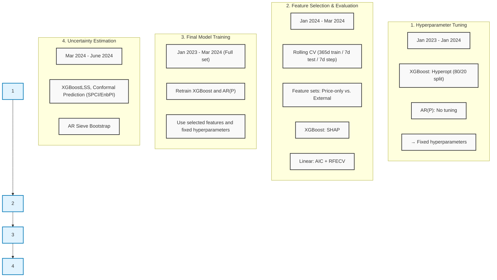

```mermaid
flowchart TB
    subgraph "1. Hyperparameter Tuning"
        A1["Jan 2023 - Jan 2024"]
        A2["XGBoost: Hyperopt (80/20 split)"]
        A3["AR(P): No tuning"]
        A4["→ Fixed hyperparameters"]
    end

    subgraph "2. Feature Selection & Evaluation"
        B1["Jan 2024 - Mar 2024"]
        B2["Rolling CV (365d train / 7d test / 7d step)"]
        B3["Feature sets: Price-only vs. External"]
        B4["XGBoost: SHAP"]
        B5["Linear: AIC + RFECV"]
    end

    subgraph "3. Final Model Training"
        C1["Jan 2023 - Mar 2024 (Full set)"]
        C2["Retrain XGBoost and AR(P)"]
        C3["Use selected features and fixed hyperparameters"]
    end

    subgraph "4. Uncertainty Estimation"
        D1["Mar 2024 - June 2024"]
        D2["XGBoostLSS, Conformal Prediction (SPCI/EnbPI)"]
        D3["AR Sieve Bootstrap"]
    end

    1 --> 2
    2 --> 3
    3 --> 4

    classDef default fill:#f9f9f9,stroke:#333,stroke-width:2px;
    classDef phase fill:#e1f3fe,stroke:#0077b6,stroke-width:2px;
    class 1,2,3,4 phase;
```

